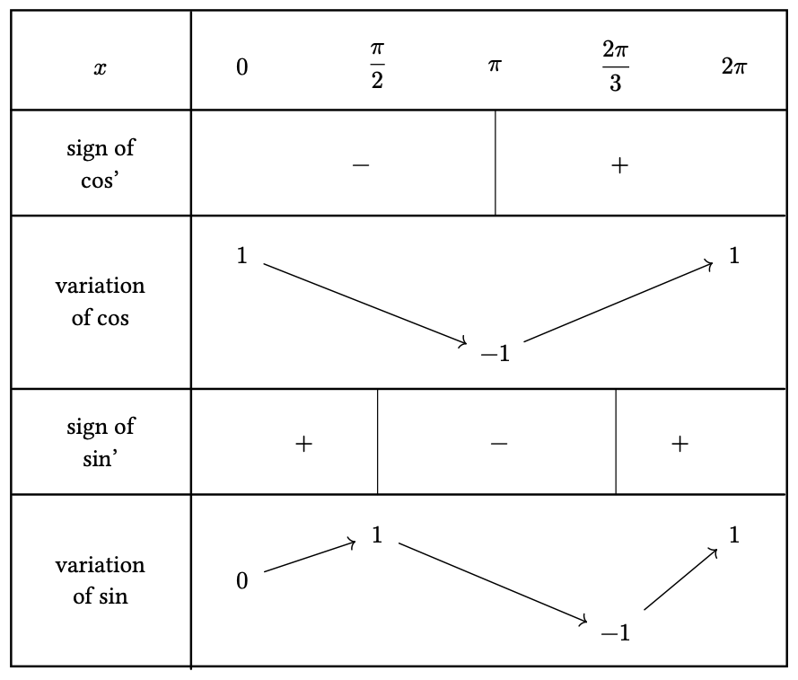
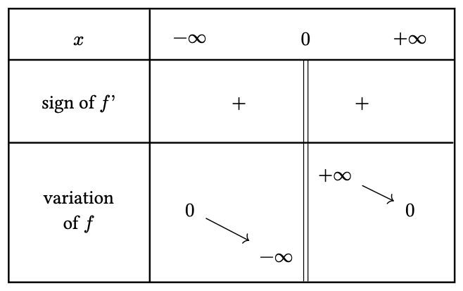

# VarTable

An easy way to render variation table on typst, built on [fletcher](https://github.com/Jollywatt/typst-fletcher)\
The [documention](https://github.com/Le-foucheur/Typst-VarTable/blob/main/documentation.pdf)


```typ
#import "@preview/Tabvar:0.1.0": tabvar
```
# Few examples


### Trigonometric functions
Turn this :
```js
#import "@preview/Tabvar:0.1.0": tabvar

#tabvar(
  init: (
    variable: $x$,
    label: (
      ([sign of cos], "Sign"),
      ([variation of cos], "Variation"),
      ([sign of sin], "Sign"),
      ([variation of sin], "Variation"),
    ),
  ),
  interval: ($0$, $ pi / 2 $, $ pi $, $ (2pi) / 3 $, $ 2 pi $),
  content: (
    ($-$, (), $+$, ()),
    (
      (top, $1$),
      (),
      (bottom, $-1$),
      (),
      (top, $1$),
    ),
    ($+$, $-$, (), $+$),
    (
      (center, $0$),
      (top, $1$),
      (),
      (bottom, $-1$),
      (top, $1$),
    ),
  ),
)
```
Into this



### hyperbolic function $f(x) = 1/x $

```js
#import "@preview/Tabvar:0.1.0": tabvar

#tabvar(
    init: (
        variable: $x$,
    label: (
        ([sign of $f$], "Sign"),
      ([variation of $f$], "Variation"),
    ),
  ),
  interval: ($ -oo $, $ 0 $, $ +oo $),
  content: (
      ($+$, ("||", $+$)),
    (
        (center, $0$),
      (bottom, top, "||", $-oo$, $+oo$),
      (center, $0$),
    ),
  ),
)
```

